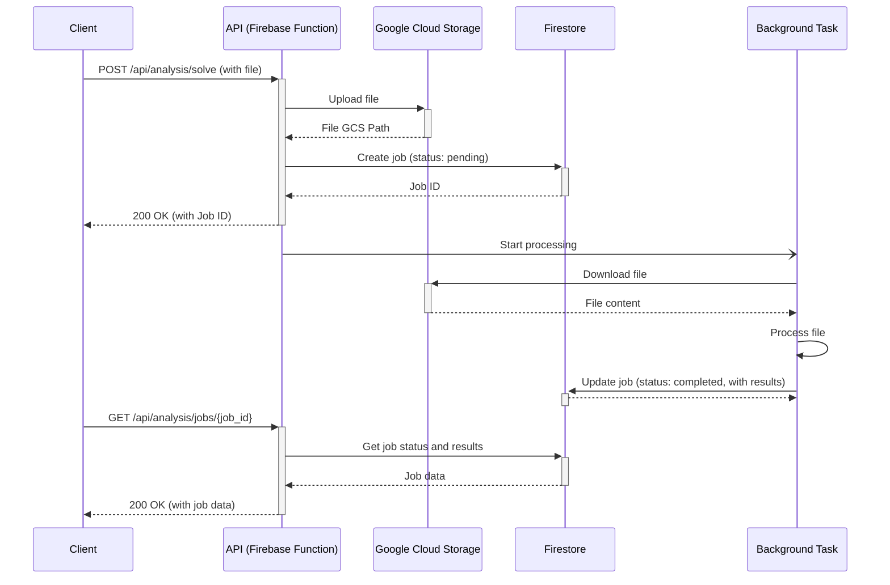

# Score AI Backend - Firebase Functions Deployment

This Flask application can be deployed to Firebase Functions for serverless hosting.

## Quick Start

### 1. Install Prerequisites
```bash
# Install Firebase CLI
npm install -g firebase-tools

# Login to Firebase
firebase login
```

### 2. Initialize Firebase (if not already done)
```bash
cd score-ai-backend
firebase init functions
```
- Select your Firebase project
- Choose Python as the language
- Don't overwrite existing files

### 3. Set Environment Variables
```bash
# Copy the environment template
cp env.template .env

# Edit .env with your actual values:
# - FIREBASE_PROJECT_ID: Your Firebase project ID
# - STORAGE_BUCKET: Your Google Cloud Storage bucket
# - GEMINI_API_KEY: Your Google Gemini API key
```

### 4. Deploy
```bash
firebase deploy --only functions
```

Your API will be available at:
```
https://your-region-your-project-id.cloudfunctions.net/api
```

## Environment Variables Required

| Variable | Description | Example |
|----------|-------------|---------|
| `ENV` | Environment (development/production) | `production` |
| `FIREBASE_PROJECT_ID` | Your Firebase project ID | `my-score-ai-project` |
| `FIRESTORE_DATABASE` | Firestore database name | `(default)` |
| `STORAGE_BUCKET` | Google Cloud Storage bucket | `my-score-ai-bucket` |
| `GEMINI_API_KEY` | Google Gemini API key | `your-api-key` |
| `GEMINI_MODEL_NAME` | Gemini model to use | `gemini-1.5-pro-latest` |

## Architecture

This backend follows a message-driven architecture, leveraging Firebase Functions for serverless execution of a Flask application. The architecture is designed to handle long-running analysis tasks asynchronously without blocking the main request thread.

### Key Components:

- **Firebase Functions**: The entire Flask application is deployed as a single Firebase Function, which handles all API requests.
- **Message-Driven Flow**: When a file is uploaded for analysis, the system initiates a background task to process the file, allowing the API to respond quickly to the client.
- **Firestore**: Used as the database to store job information, status, and results.
- **Cloud Storage**: Used to store the uploaded files for analysis.

### Workflow:

1.  **Request**: The client sends a `POST` request to the `/api/analysis/solve` endpoint with a file to be analyzed.
2.  **Job Creation**: The `analysis` module receives the request, uploads the file to Google Cloud Storage, and creates a new job in Firestore with a `pending` status.
3.  **Background Task**: A background thread is spawned to run the `processing` service, which handles the actual analysis of the file.
4.  **Response**: The API immediately returns a response to the client with the job ID, without waiting for the analysis to complete.
5.  **Processing**: The `processing` service analyzes the file, and upon completion, updates the job status in Firestore to `completed` and stores the results.
6.  **Polling**: The client can then poll the `/api/analysis/jobs/<job_id>` endpoint to check the status of the job and retrieve the results once the analysis is complete.

### Diagram:



## API Endpoints

After deployment, your endpoints will be:

- **Health Check**: `GET https://your-function-url/api/health/`
- **Authentication**: `POST https://your-function-url/api/auth/*`
- **Analysis Jobs**: `GET/POST/DELETE https://your-function-url/api/analysis/*`
- **File Analysis**: `POST https://your-function-url/api/analysis/solve`
- **Chat**: `POST https://your-function-url/api/chat/*`

## Local Development

### Option 1: Functions Framework
```bash
# Install dependencies
pip install -r requirements.txt

# Run with Functions Framework
functions-framework --target api --port 8080
```

### Option 2: Firebase Emulator
```bash
firebase emulators:start --only functions
```

### Option 3: Traditional Flask
```bash
python main.py
```

## Project Structure

```
score-ai-backend/
├── main.py              # Firebase Functions entry point
├── app.py               # Flask app factory
├── config.py            # Configuration settings
├── requirements.txt     # Python dependencies
├── firebase.json        # Firebase configuration
├── .gcloudignore       # Files to ignore during deployment
├── core/               # Core functionality
│   ├── firestore.py    # Firestore operations
│   ├── storage.py      # Cloud Storage operations
│   ├── security.py     # Authentication
│   └── schemas.py      # Data schemas
└── modules/            # API modules
    ├── auth/           # Authentication endpoints
    ├── analysis/       # Analysis endpoints
    ├── health/         # Health check endpoints
    ├── chat/           # Chat endpoints
    └── processing/     # File processing services
```

## Deployment Notes

1. **Authentication**: The app uses Firebase Admin SDK with the default service account in Cloud Functions
2. **File Uploads**: Supports PDF file uploads for mathematical problem analysis
3. **Database**: Uses Firestore for job and result storage
4. **AI Integration**: Uses Google Gemini for problem-solving analysis
5. **CORS**: Configured for cross-origin requests from your Flutter app
